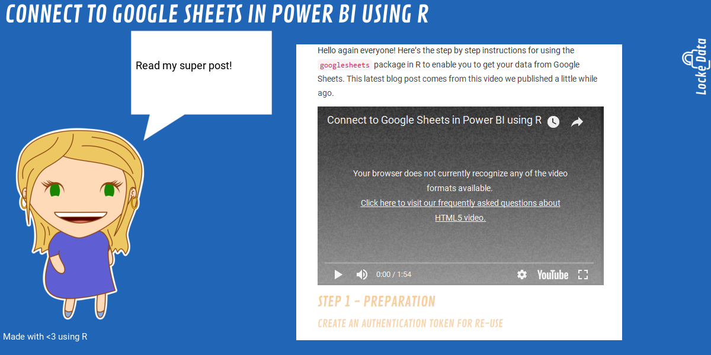

<!-- README.md is generated from README.Rmd. Please edit that file -->
locketweet
==========

The goal of locketweet is to help us get a collection of screenshots without too much effort.

Installation
------------

You can install locketweet from GitHub with:

``` r
# install.packages("devtools")
devtools::install_github("lockedata/locketweet")
```

See [this blog post](https://itsalocke.com/blog/how-to-maraaverickfy-a-blog-post-without-even-reading-it/) for more background info.

Evergreen posts
---------------

See \[inst/extdata/evergreen.csv\].

Examples
--------

``` r
library("locketweet")
webshot_prettyplease(url = "https://itsalocke.com/blog/auto-deploying-documentation-better-change-tracking-of-artefacts/")
```


``` r
webshot_prettyplease(url = "https://itsalocke.com/blog/how-to-maraaverickfy-a-blog-post-without-even-reading-it/")
```


