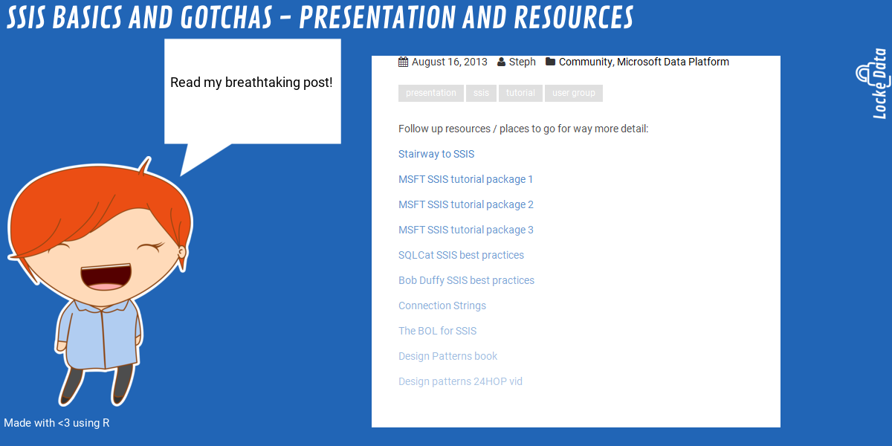
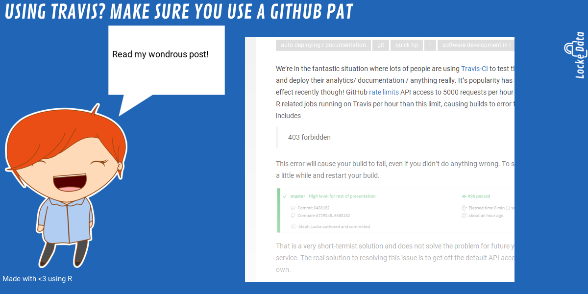
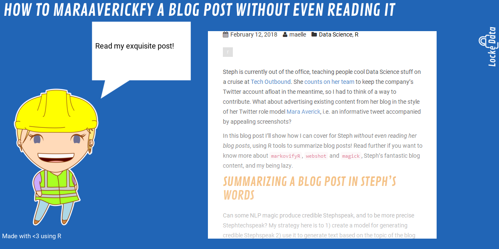

<!-- README.md is generated from README.Rmd. Please edit that file -->

# locketweet

The goal of locketweet is to help us get a collection of screenshots
without too much effort.

## Installation

You can install locketweet from GitHub with:

``` r
# install.packages("devtools")
devtools::install_github("lockedata/locketweet")
```

See [this blog
post](https://itsalocke.com/blog/how-to-maraaverickfy-a-blog-post-without-even-reading-it/)
for more background info.

## Evergreen posts

See [inst/extdata/evergreen.csv](inst/extdata/evergreen.csv).

## Examples

``` r
library("locketweet")
webshot_prettyplease(url = "https://itsalocke.com/blog/auto-deploying-documentation-better-change-tracking-of-artefacts/")
```


``` r

webshot_prettyplease("https://itsalocke.com/blog/ssis-basics-and-gotchas--presentation-and-resources/")
```



``` r

webshot_prettyplease("https://itsalocke.com/blog/shiny-module-design-patterns-pass-module-input-to-other-modules/")
```


``` r

webshot_prettyplease("https://itsalocke.com/blog/using-travis-make-sure-you-use-a-github-pat/")
```



``` r
webshot_prettyplease("https://itsalocke.com/blog/connect-to-google-sheets-in-power-bi-using-r/")
```


``` r
webshot_prettyplease(url = "https://itsalocke.com/blog/how-to-maraaverickfy-a-blog-post-without-even-reading-it/")
```



``` r
webshot_prettyplease(url = "https://itsalocke.com/blog/a-particles-arly-fun-book-draw/")
```


``` r
webshot_prettyplease(url = "https://itsalocke.com/blog/how-to-use-an-r-interface-with-airtable-api/")
```


``` r
webshot_prettyplease(url = "https://itsalocke.com/blog/r-quick-tip-parameter-re-use-within-rmarkdown-yaml/")
```


